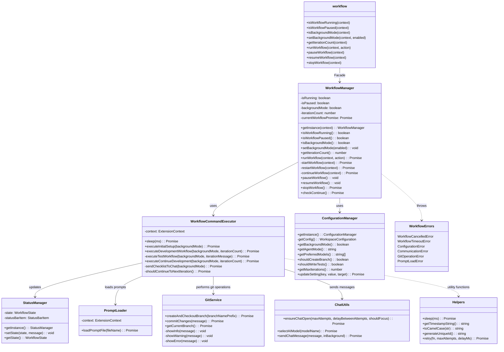

# Marco AI: Copilot Control Automation

Marco AI is a VS Code extension that automates GitHub Copilot chat workflows. It provides a structured approach to using AI assistance in your development workflow, with features for managing workflow status, controlling execution, and configuring how the AI assistant interacts with your codebase.

## Features

- **Workflow Automation**: Automate multi-step workflows with GitHub Copilot, including code generation, test creation, and code review.
- **Interactive Controls**: Control the workflow through the Floating Controls Panel or Sidebar interface.
- **Background Mode**: Let the AI work in the background while you focus on other tasks.
- **Git Integration**: Automatically create feature branches for new development tasks.
- **Configurable Workflow**: Customize the workflow to match your development process.

## Architecture

The extension follows a Service Layer architecture pattern with the following components:

```
src/
├── commands/          # Command registration and handling
├── errors/            # Custom error types
├── monitoring/         # Services for monitoring workflow state
├── services/          # Core services (StatusManager, ConfigurationManager, etc.)
├── ui/                # UI components (FloatingControlsPanel, SidebarProvider)
├── utils/             # Utility functions 
├── workflows/         # Workflow definition and management
└── extension.ts       # Main extension entry point
```

### Key Components

- **WorkflowManager**: Singleton service that manages workflow state and coordinates execution.
- **WorkflowCommandExecutor**: Executes the specific commands for each workflow step.
- **StatusManager**: Tracks and displays the current workflow state.
- **ConfigurationManager**: Manages extension settings and configuration.
- **ChatUtils**: Handles interactions with GitHub Copilot chat.
- **GitService**: Provides Git operations like branch creation and commits.

## Class Diagram



## Design Patterns

- **Facade Pattern**: The `workflow.ts` module acts as a facade, providing a simplified interface to the more complex `WorkflowManager`.
- **Singleton Pattern**: Services like `StatusManager`, `ConfigurationManager`, and `WorkflowManager` are implemented as singletons to ensure single instances manage global state.
- **Service Layer Pattern**: The codebase is organized into distinct service layers with clear responsibilities (core services, UI services, infrastructure services).

## Extension Settings

This extension contributes the following settings:

* `marco.backgroundMode`: Enable/disable background mode for workflows.
* `marco.agentMode`: Set the agent mode (Agent, Edit, Ask).
* `marco.preferredModels`: List of AI models to use in order of preference.
* `marco.initCreateBranch`: Whether to create a new branch when starting a workflow.
* `marco.needToWriteTest`: Whether to include test writing steps in the workflow.
* `marco.maxIterations`: Maximum number of iterations for a workflow.
* `marco.checkAgentFrequency`: Frequency for checking agent status (ms).
* `marco.ensureChatFrequency`: Frequency for ensuring chat is open (ms).

## Commands

* `marco.toggleWorkflow`: Start or stop the workflow.
* `marco.pauseWorkflow`: Pause or resume the current workflow.
* `marco.restart`: Restart the workflow from the beginning.
* `marco.openChat`: Open GitHub Copilot Chat.
* `marco.openSidebar`: Open the Marco AI sidebar.
* `marco.checkAgentAlive`: Check if the agent is still working.
* `marco.toggleBackgroundMode`: Toggle background mode on/off.
* `marco.showFloatingControls`: Show the floating controls panel.
* `marco.showWelcome`: Show the welcome page.

## Workflow States

- `idle`: Workflow is not running.
- `initializing`: Setting up the workflow environment.
- `creating-branch`: Creating a new branch for the task.
- `sending-task`: Sending task instructions to the AI agent.
- `checking-status`: Checking the agent's progress.
- `requesting-tests`: Requesting test implementation.
- `verifying-completion`: Verifying task completion.
- `verifying-checklist`: Checking off items in the task checklist.
- `continuing-iteration`: Moving to the next iteration.
- `paused`: Workflow is paused.
- `completed`: Workflow has successfully completed.
- `error`: Workflow encountered an error.

## License

MIT
